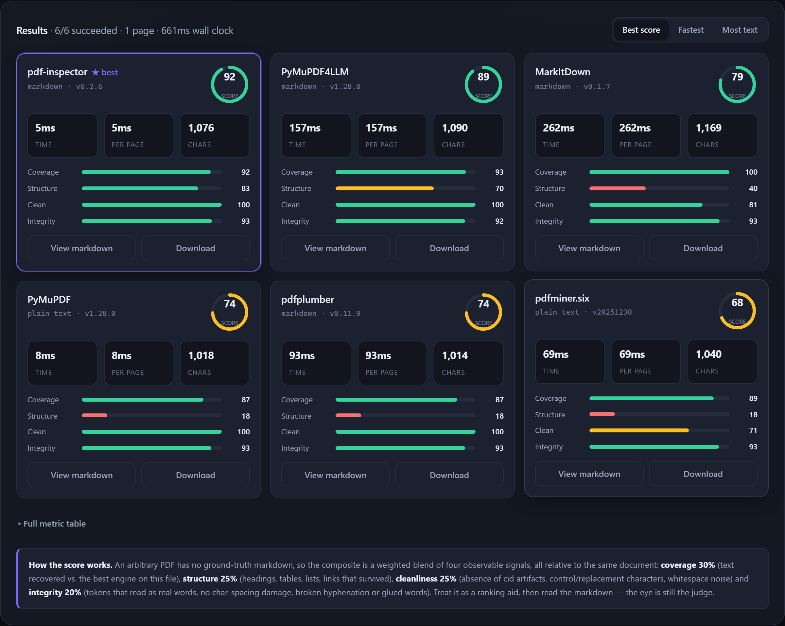

# PDF → Markdown Bench

Upload one PDF, run every PDF-to-markdown engine against it, and compare
**speed**, **conversion quality** and the **actual markdown** side by side.

Built for picking an extraction strategy for a RAG pipeline, where the choice
is usually a trade between "fast and flat" and "slow and structured".



## Quick start

The app runs in two modes and picks between them automatically, by asking the
page's own origin for `/api/engines` at startup. The badge in the top bar tells
you which one is live.

**Python engines** — the real converter libraries (this is what the screenshot
above shows). Needs an install and a local server:

```bash
pip install -r requirements.txt
python run.py                               # -> http://127.0.0.1:8000
```

**Browser engines** — no install, no server, no build step; conversion happens
client-side on pdf.js:

```bash
cd frontend && python -m http.server 8000   # or any static file server
```

Either way the PDF stays on your machine: the static build never uploads it,
and the server build only talks to `127.0.0.1`. The static build is what's
deployed to GitHub Pages, which is why the browser engines exist at all — a
page served from Pages has no Python behind it.

## Engines

### Python engines (server mode)

Registered in [backend/converters.py](backend/converters.py). Each one is
probed at startup: an engine whose library isn't installed shows up greyed out
with an install hint instead of breaking the app, so a partial
`pip install` is fine.

| Engine | Output | Notes |
| --- | --- | --- |
| **PyMuPDF** | plain text | Raw text layer. The speed baseline — no structure detection. |
| **PyMuPDF4LLM** | markdown | PyMuPDF's RAG-oriented layer: headings from font sizes, GFM tables. |
| **MarkItDown** | markdown | Microsoft's any-file-to-markdown tool; pdfminer under the hood for PDFs. |
| **pdf-inspector** | markdown | Rust-backed per-page extraction that also flags OCR-needing pages and multi-column layouts. |
| **pdfplumber** | markdown | Precise word/table geometry; tables lifted with its own detector. |
| **pdfminer.six** | plain text | The classic pure-Python extractor many other tools are built on. |
| **AnyDoc** | markdown | Firecrawl's Rust-backed parser (PDF, DOCX, PPTX, XLSX, EPUB). |
| **Docling** | markdown | IBM's layout-model pipeline. Most structure-aware, by far the slowest — off by default, downloads models on first run. |
| **Unlimited-OCR** | markdown | Baidu's DeepSeek-OCR vision-language parser. Always reports unavailable: it needs a local GPU inference server, not a pip install. |

### Browser engines (static mode)

Heuristic, not ML-based — font-size ranking and x/y clustering on the text
layer [pdf.js](https://mozilla.github.io/pdf.js/) exposes (vendored in
`frontend/vendor/pdfjs/`). See [frontend/engines.js](frontend/engines.js).

| Engine | Output | Notes |
| --- | --- | --- |
| **PDF.js — Raw text** | plain text | Text layer joined in reading order. No structure detection. |
| **PDF.js — Structured** | markdown | Headings ranked from font-size, bullet/numbered lists, paragraph reflow. |
| **PDF.js — Structured + tables** | markdown | Same heuristics, plus column-alignment table detection as GFM tables. |

Every engine is optional to run (all available, non-heavy ones are pre-selected);
one that throws is reported on its own card and the other engines still finish.

## How the score works

An arbitrary PDF has no ground-truth markdown, so the composite is a weighted
blend of four observable signals — all measured on the *same* document, which
is what makes them comparable:

| Sub-score | Weight | What it measures |
| --- | --- | --- |
| **Coverage** | 30% | Characters recovered vs. the best engine on this file. |
| **Structure** | 25% | Headings, tables, list items, links and emphasis that survived. |
| **Cleanliness** | 25% | Absence of `(cid:N)` artifacts, control/replacement characters, whitespace and column-gap noise. |
| **Integrity** | 20% | Tokens that read as real words; no char-spacing damage, broken hyphenation or glued-together words. |

Coverage is relative and computed once every engine has reported (in
[frontend/app.js](frontend/app.js), so it works the same in both modes); the
other three are absolute, computed in
[frontend/metrics.js](frontend/metrics.js) for browser engines and by its
line-for-line Python port [backend/metrics.py](backend/metrics.py) for server
engines. Both expose the raw counts behind each sub-score in the **Metrics**
tab.

Two honest caveats:

- **Structure is document-dependent.** A PDF with no tables gives no engine
  table points. That's fine for ranking engines against each other on one
  file, and meaningless as an absolute number.
- **Raw text scores low on structure by construction.** It isn't trying to
  emit markdown. Read its card as the speed and coverage floor, not a failure.

Use the score to order the field, then open the viewer and read the output —
the side-by-side compare is where the real differences show up.

## Using it

1. Drop a PDF on the upload zone. In browser mode the file is read directly by
   the browser and never goes anywhere; in server mode it's handed to the local
   server once and every engine converts from that one copy.
2. Tick the engines to race (available, non-heavy ones are pre-selected).
3. Pick a page limit (default: first 5 pages — raise it for a real benchmark).
4. **Run comparison.** Engines run sequentially by default so the timings are
   clean; tick *Run in parallel* when you only care about the output.
5. Sort by score / speed / volume, then **View markdown** for the rendered
   output, raw source, full metrics, or a side-by-side diff against any other
   engine. Copy or download any result as `.md`.

## Layout

```
frontend/
  index.html          single page, no build step
  app.js              state, rendering, scoring, and a dependency-free
                      markdown renderer. Owns the mode switch.
  engines.js          the three pdf.js-based conversion engines
  server-engines.js   client for backend/main.py: the startup probe that
                      decides the mode, plus upload/convert/release
  metrics.js          quality heuristics (structure / cleanliness / integrity)
  pdf-loader.js       wires up the vendored pdf.js module + worker
  pdf-worker-shim.mjs worker entry point: polyfill, then the real worker
  upsert-polyfill.mjs Map.prototype.getOrInsertComputed, which pdf.js needs
                      and no browser ships yet
  vendor/pdfjs/       vendored pdf.js build (Apache-2.0, Mozilla)
  styles.css          design tokens, dark + light
backend/
  main.py             FastAPI: /api/engines, /api/upload, /api/convert, and it
                      serves frontend/ so the probe finds it on the same origin
  converters.py       the Python engine registry
  metrics.py          Python port of metrics.js — same numbers, same shape
run.py                starts the server
```

### Adding an engine

**Browser engine:** write a function `(pdfDoc, maxPages) -> Promise<string>`
(a pdf.js `PDFDocumentProxy` in, markdown or plain text out) and add it to
`DEFS` in [frontend/engines.js](frontend/engines.js), which also exports
`extractLines(page)` for text-geometry extraction (position, font size, per
line) if your engine wants to reuse it.

**Python engine:** write a function `(data: bytes, max_pages: int | None) ->
str` and register it with the `@register(Engine(...))` decorator in
[backend/converters.py](backend/converters.py). Give `module` and `dist` the
import and distribution names and availability, versions and install hints are
handled for you.

Nothing else needs touching in either case: the UI, scoring and metric table
are driven off the engine list the active mode reports.

## Notes

- The markdown preview renderer escapes every character before generating
  markup, so converter output can't inject markup into the page.
- Encrypted PDFs (ones that need a password to open) are rejected at upload
  with a clear message rather than failing once per engine — by pdf.js in
  browser mode, by the server's PyMuPDF probe in server mode.
- Several Python engines are Rust extensions, and a panic in one surfaces as
  `pyo3`'s `PanicException`, which does not derive from `Exception`. The runner
  catches it anyway so one panicking engine costs you its own card and not the
  whole run.
- The vendored pdf.js calls `Map.prototype.getOrInsertComputed`, from TC39's
  [upsert proposal](https://github.com/tc39/proposal-upsert), which no browser
  ships yet — `frontend/upsert-polyfill.mjs` supplies it to both the main
  thread and the worker. Without it, browser mode fails on every PDF. Delete it
  once browsers catch up.
- The heuristics in browser mode are geometry-based, not ML-based: multi-column layouts,
  rotated text, and unusual table shapes will fool them more easily than
  they'd fool a layout model like Docling. Read the output, don't just trust
  the score.
